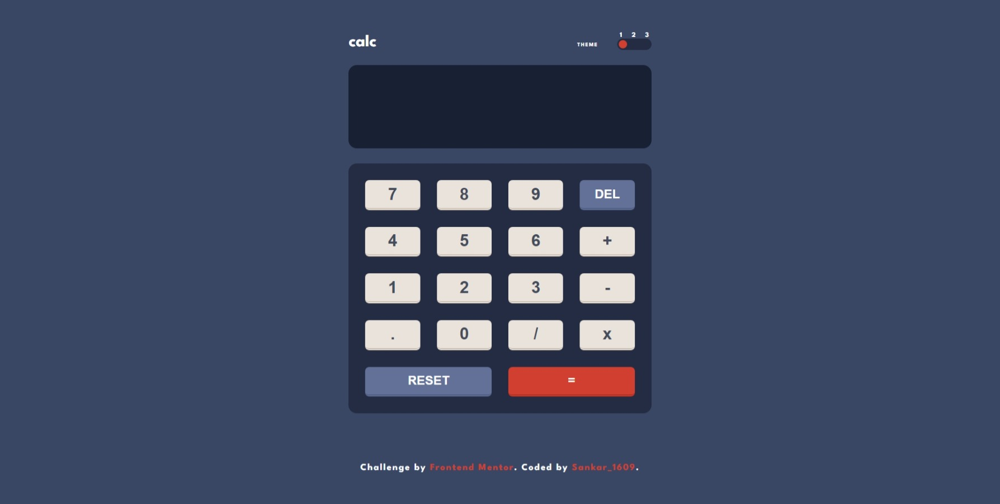

# Frontend Mentor - Calculator app solution

This is a solution to the [Calculator app challenge on Frontend Mentor](https://www.frontendmentor.io/challenges/calculator-app-9lteq5N29). 

## Table of contents

- [Overview](#overview)
  - [The challenge](#the-challenge)
  - [Screenshot](#screenshot)
  - [Links](#links)
- [My process](#my-process)
  - [Built with](#built-with)
  - [What I learned](#what-i-learned)
- [Author](#author)
- [Acknowledgments](#acknowledgments)

**Note: Delete this note and update the table of contents based on what sections you keep.**

## Overview

### The challenge

Users should be able to:

- See the size of the elements adjust based on their device's screen size
- Perform mathmatical operations like addition, subtraction, multiplication, and division
- Adjust the color theme based on their preference
- **Bonus**: Have their initial theme preference checked using `prefers-color-scheme` and have any additional changes saved in the browser

### Screenshot

### Links

- Solution URL: [Add solution URL here](https://your-solution-url.com)
- Live Site URL: [Add live site URL here](https://your-live-site-url.com)

## My process

### Built with

- HTML5 
- CSS 
- CSS variables
- Flexbox
- CSS Grid

### What I learned

I learned a lot in this project. The main part is how to create a toggler for changing the theme of the page. It took two days to learn stuff and create it. I got final end product but in the process I learned a lot of stuff. The js part was easy though I got help from stackOverflow . But designing that toggler took lot of efforts. I learned about CSS variables in this project. Previously I don't know about that. The calculator part of js took some time. Web dev Simplified's calc logic was the one I followed. I am gradually improving in understanding js. In future possibly I could do js parts without a lot of help.

## Author

- Frontend Mentor - [@AkashKrish1609](https://www.frontendmentor.io/profile/AkashKrish1609)
- Twitter - [@SANKAR_1609](https://twitter.com/SANKAR_1609)

## Acknowledgments

In this project I took a lot of help in different parts.
calculator logic- web dev simplified
other doubts- stackOverFlow
and more can't remember..
